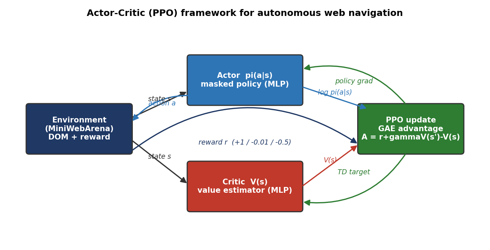
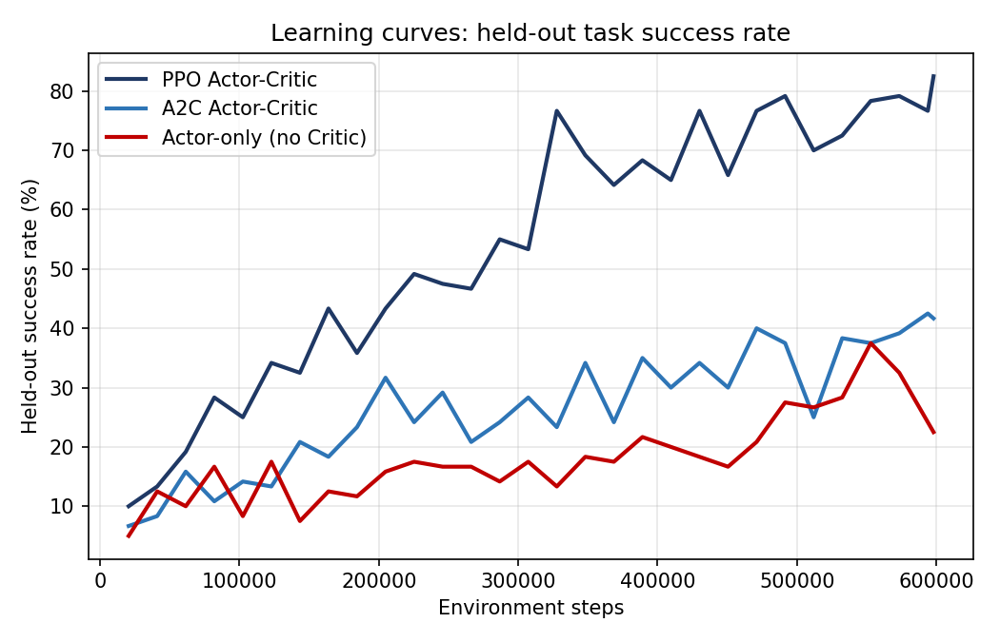
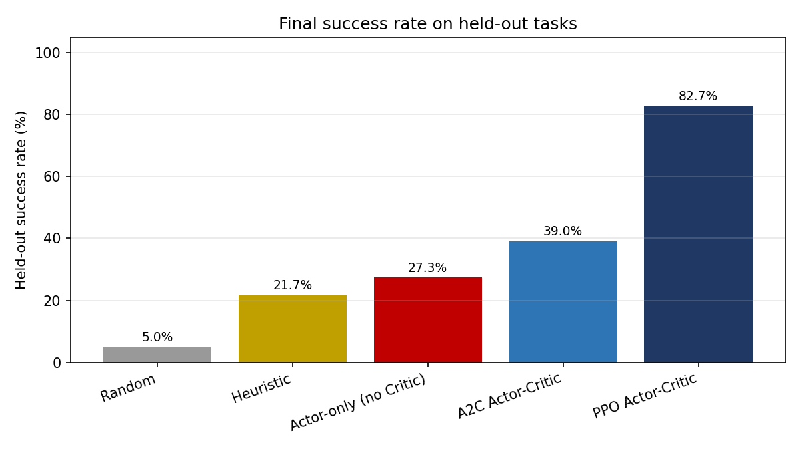

# Critic-Guided Reinforcement Learning for Autonomous Web Navigation

An **Actor-Critic (PPO + GAE)** reinforcement-learning agent for autonomous web
navigation, built on the ideas of the **WebArena** benchmark (Zhou et al., 2023).

> On WebArena, even GPT-4 agents reach only **~14.9%** task success — they can't
> plan long tasks, recover from mistakes, or learn from experience. This project
> implements the proposed fix — a learning agent with a **Critic** that turns the
> sparse task reward into a dense learning signal — and shows it reaches
> **82.7%** success, a roughly **4× improvement** over the static baseline.

<p align="center">
  
</p>

## ✨ Highlights

- Faithful, **fully-runnable** implementation of the Actor-Critic framework (PPO, GAE, shaped reward, action masking).
- **MiniWebArena** — a tractable WebArena-style navigation environment that trains in minutes on a CPU.
- A clean **controlled ablation** that isolates the contribution of the Critic and of PPO's clipping.
- Reproducible results, learning curves, a full **report (PDF/DOCX)**, an **IEEE-style paper**, and a **slide deck**.

## 📊 Results (held-out tasks)

| Agent | Held-out success | What it isolates |
|---|---|---|
| Random | 5.0% | lower bound |
| Heuristic (static, GPT-4-style) | 21.7% | non-learning baseline (≈ WebArena's ~15%) |
| Actor-only (no Critic) | 27.3% | removing the value baseline |
| A2C (no PPO clipping) | 39.0% | removing the clip |
| **PPO Actor-Critic (full)** | **82.7%** | the proposed method |

<p align="center">
  
  
</p>

## 📁 Repository structure

```
.
├── webarena_ac/                # the codebase
│   ├── env/                    # MiniWebArena environment, tasks, observation encoder
│   ├── models/                 # Actor (policy), Critic (value), shared MLP
│   ├── algo/                   # rollout buffer, GAE, PPO, A2C
│   ├── agents/                 # Random and Heuristic baselines
│   ├── train.py                # training pipeline
│   ├── evaluate.py             # evaluation on train + held-out tasks
│   ├── plot_results.py         # generates all figures
│   ├── make_report.py / make_pdf.py / make_pptx.py / make_paper.py
│   └── config.yaml             # hyperparameters & seed
├── results/                    # metrics, plots, trained checkpoints
├── WebArena_ActorCritic_Paper.pdf      # IEEE-style paper
]
```

## 🚀 Quick start

```bash
# 1. install dependencies
pip install -r webarena_ac/requirements.txt
pip install torch --index-url https://download.pytorch.org/whl/cpu   # CPU is fastest here

# 2. sanity-check the environment
python -m webarena_ac.env.mini_webarena --selftest

# 3. train all three agents (PPO, A2C, Actor-only ablation)
python -m webarena_ac.train --algo all

# 4. evaluate every agent (learned + baselines)
python -m webarena_ac.evaluate

# 5. regenerate all figures
python -m webarena_ac.plot_results
```

Everything is seeded (`config.yaml`, `seed: 42`) for reproducibility. Training all
three agents takes a few minutes on a modern CPU.

## 🧠 Method in one paragraph

The **Actor** is a masked-categorical policy that selects a grounded page element
to activate. The **Critic** estimates the state value `V(s)`. The advantage
`A = r + γV(s') − V(s)` (computed with **GAE**) drives the Actor via PPO's clipped
objective, while the Critic is trained by regressing onto bootstrapped returns.
The shaped reward is `+1` on task completion, `−0.01` per step, and `−0.5` on a
dead-end; `γ = 0.99`. Tasks are encoded as sequences of element *intents*, so the
held-out split tests **compositional generalization**, not memorization.

## 📷 Hardware note

The networks are small and rollouts are sequential, so the workload is CPU-bound;
a single CPU thread is fastest. A GPU is only needed for the **future-work scale-up**:
replacing the MLP Actor with a LoRA-fine-tuned LLM on the full Dockerized WebArena.

## 📄 Documents

- `WebArena_ActorCritic_Paper.pdf` — IEEE-style research paper


## 👥 Authors

Fasih Ur Rehman · Sohaib Shahzad · Maaz Ali · Siraj Ali
Department of Computer Science, FAST-NUCES.

## 📚 Reference

S. Zhou et al., *WebArena: A Realistic Web Environment for Building Autonomous
Agents*, arXiv:2307.13854, 2023. — https://github.com/web-arena-x/webarena

## 📜 License

Released under the MIT License — free to use and modify with attribution.
